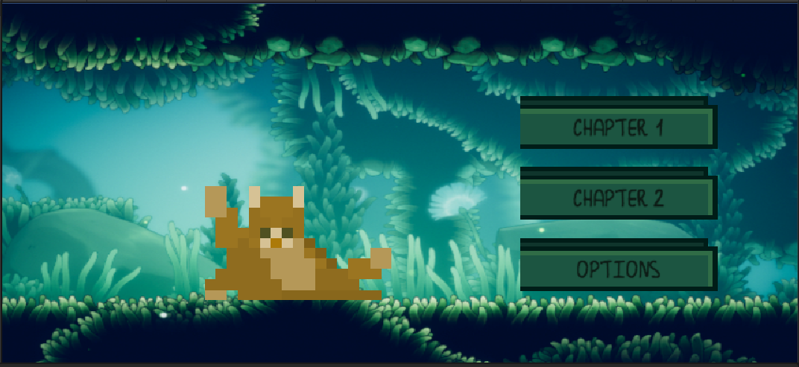
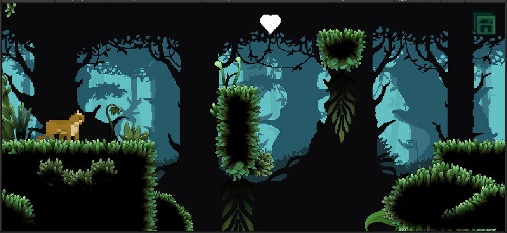
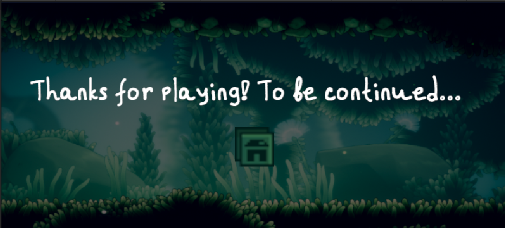

# Cat's Travel
__Cat's Travel__ - индивидуальный учебный проект. Это короткая игра-платформер без сюжета с красивыми декорациями. [Макет](https://www.figma.com/design/hh9AP7CGkVud4EzVcUyYOw/%D0%9F%D0%BB%D0%B0%D1%82%D1%84%D0%BE%D1%80%D0%BC%D0%B5%D1%80-Unity?node-id=0-1&t=28PjSCbi3MG8m5sQ-0). [exe-Файл игры в облачном хранилище](https://drive.google.com/drive/folders/11abiV5Dh-rc3GzQYFGC9HXXapnr4PGzx).
## Технологии
+ C#
## Скриншоты проекта

## Возможности
Реализованы: 
+ меню; 
+ одна глава игры;
+ экран, гарантирующий продолжение игры при похождении первой главы;

Возможно будут добавлены:
+ возможность выключить и включить звук
## Комментарии
Все материалы были созданы не мной, поэтому мне не принадлежат. Ссылки на сайты, где эти материалы были скачаны:
+ [Mossy Cavern by Maaot](https://maaot.itch.io/mossy-cavern)
+ [Pixel Art Woods Tileset and Background by karsiori](https://assetstore.unity.com/packages/2d/environments/pixel-art-woods-tileset-and-background-280066) (Backround)
+ [40+ Simple Icons by shuvadanil](https://assetstore.unity.com/packages/2d/gui/icons/40-simple-icons-free-171008) (Heart icon)
+ [Pet Cats Pixel Art Pack by Luiz Melo](https://assetstore.unity.com/packages/2d/characters/pet-cats-pixel-art-pack-248340)
+ [Pixel buttons by PogUTatar](https://pogutatar.itch.io/pixel-button-pack-by-pogutatar)
+ [FREE 25 fantasy RPG game tracks](https://alkakrab.itch.io/free-25-fantasy-rpg-game-tracks-no-copyright-vol-2)